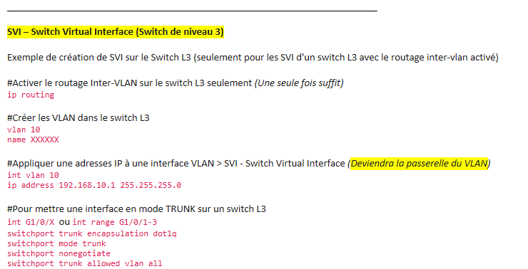

# COURS - VLAN - Virtual LAN
----------------------------

- Les VLANs reposent sur des connexions logiques, et non des connexions physiques.
- Port en mode TRUNK ou ACCESS
    - TRUNK = Un ou Plusieurs VLAN
    - ACCESS = Un seul VLAN

## Cours VLAN 
- https://learn.spoofing.cloudns.pro/ccna2/course/module3/index.html#3.1.1.1

## Cours ACCESS 
- https://learn.spoofing.cloudns.pro/ccna2/course/module3/index.html#3.2.1.3

## Cours TRUNK 
- https://learn.spoofing.cloudns.pro/ccna2/course/module3/index.html#3.2.2.1

# VLAN Voice - Cisco uniquement

