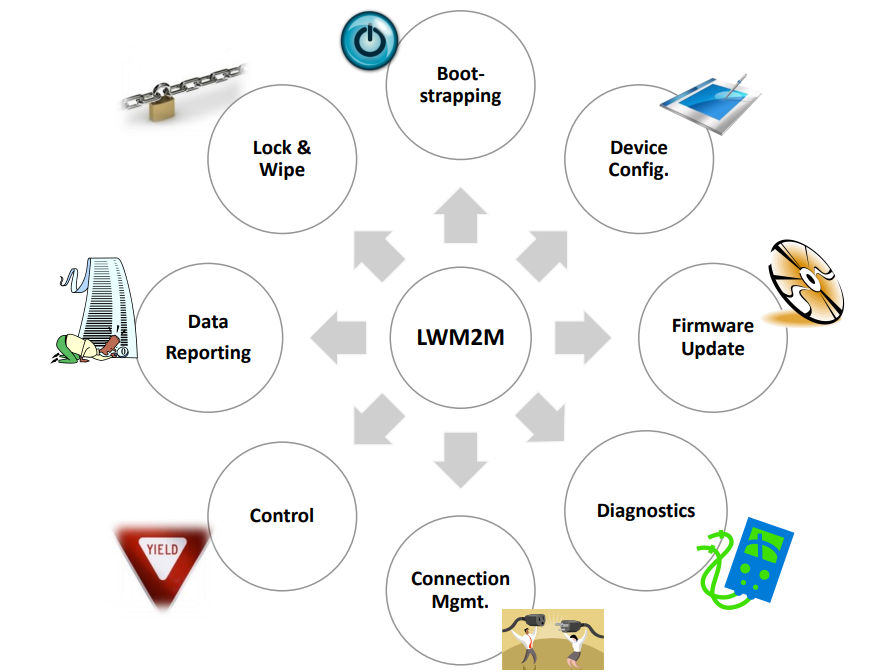

# OMA LightweightM2M

# Définition 

LightweightM2M is a **fast deployable client-server specification that provides a machine to machine service**.

LightweightM2M is principally a **device management protocol** that has been designed to **be extensible to meet application requirements**. LightweightM2M is not restricted to device management, it can be **used to transfer service / application data**.

LightweightM2M defines the interface between M2M device and M2M Server. It enables the M2M Service Provider to deploy a M2M system to provide service to the M2M user.

# Benefits

LwM2M is recommended for Device Management and Service Enablement because its benefits include:

- **Increased bandwidth efficiency **based on COAP bandwidth optimization
- Transport-agnostic design that supports **UDP, TCP, SMS**
- **Developer toolkit** for application development
- **DTLS-based security** based on CoAP (IETF)
- **Low power client foot print** designed for battery constrained devices
- **End to end security** using IETF OSCORE

# Bootstrap Interface

# LwM2M Security 

Credential precedures supported : 
- Certificates
- Pre-shared key
- Public Raw Key
- PKI deployments

Security paths
- DTLS
- SMS
- DTLS over SMS
- OSCORE

LWM2M Security abilities 
- Initial keys can be replaced during bootstrap procedure
- Multiple servers could be added with different credentials
- Provide security in very path 

# Data model 
## Resource Model : 
Object / Instance / Resource 
16-bit IDs 

# Reusable Resource IDs : 
- Resource 5601 is always a float containing the minimum value measured by a sensor. 

## Specify data type and allowed operations :  
- Read,
- Write,
- Execute,
- Create,
- Delete,
- Observe

## Well-known Object IDs : 
- 3303 is a temperature sensor, 3311 is a light control 

# Life Cycle 

- **Client Registration **
  - Register 
  - Update registration 
  - De-register 

- **Device Management **
  - Read 
  - Write 
  - Execute 
  - Create and Delete 

- **Information Reporting **
  - Observe 
  - Notify 
  - Cancel 
 
# COAP
 
CoAP (Constrained Application Protocol) is a specialized Internet application protocol designed for resource-constrained devices and networks, such as those used in the Internet of Things (IoT) and Machine-to-Machine (M2M) communication. 

CoAP is a useful protocol for IoT and M2M communication, as it offers an efficient and reliable way for devices to communicate with each other in a constrained network environment : 
- in a low-power,  
- low-bandwidth,  
- and low-latency network environment.  

It is based on :  
- the REST (Representational State Transfer) architecture  
- and uses UDP (User Datagram Protocol) as the underlying transport protocol, which makes it well suited for constrained devices that have limited : 
  - processing power,  
  - memory, and  
  - battery life. 

 

CoAP provides a set of methods that allow clients to interact with resources on servers over the Internet :  
- GET,  
- POST,  
- PUT,  
- and DELETE 

It also supports a wide range of content types and provides various features, such as : 
- caching,  
- discovery,  
- and group communication. 

# Sources

https://technical.openmobilealliance.org/

https://technical.openmobilealliance.org/Overviews/lightweightm2m_overview.html#:~:text=LightweightM2M%20is%20a%20fast%20deployable%20client-server%20specification%20that,designed%20to%20be%20extensible%20to%20meet%20application%20requirements.

https://www.openmobilealliance.org/release/LightweightM2M/Lightweight_Machine_to_Machine-v1_1-OMASpecworks.pdf

https://technical.openmobilealliance.org/OMNA/LwM2M/LwM2MRegistry.html

https://github.com/IOTEROP/IOWA