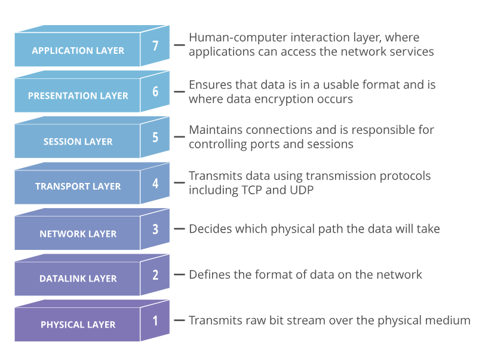

# Ports URI, UDP et TCP 

**Un port est un point virtuel où les connexions réseau commencent et se terminent. Les ports sont basés sur des logiciels et gérés par le système d'exploitation d'un ordinateur. Chaque port est associé à un processus ou à un service spécifique.**

Les ports permettent aux ordinateurs de différencier facilement les différents types de trafic : les courriers électroniques sont acheminés vers un port différent de celui des pages web, par exemple, même si les deux atteignent un ordinateur via la même connexion Internet.

Les ports sont normalisés sur tous les périphériques connectés au réseau, et un numéro est attribué à chaque port. La plupart des ports sont réservés à certains protocoles, par exemple, tous les messages Hypertext Transfer Protocol (HTTP) vont au port 80. Alors que les adresses IP permettent aux messages d'aller vers et depuis des périphériques spécifiques, les numéros de port permettent de cibler des services ou des applications spécifiques au sein de ces périphériques.

Des types de données très différents circulent vers et depuis un ordinateur sur la même connexion réseau. L'utilisation de ports aide les ordinateurs à comprendre ce qu'ils doivent faire avec les données qu'ils reçoivent.

# Où sont les ports sur le model OSI ? 

Les ports sont un concept de la couche transport (couche 4). Seul un protocole de transport tel que le protocole de contrôle de transmission (TCP) ou le User Datagram Protocol (UDP) peut indiquer à quel port un paquet doit être envoyé. 

# IoTerop ports 

        | udp.port == 5683 | 
        | udp.port == 5684 | 
        | udp.port == 5783 | 
        | udp.port == 5784 | 
        
        | tcp.port == 5683 | 
        | tcp.port == 5684 | 

Voici quelques formats du URI (adresse IP et port) 

        "coap://{hostname}[:{port}]" for unsecure UDP transport 
        "coaps://{hostname}[:{port}]" for secure UDP transport (using DTLS) 
        "coap+tcp://{hostname}[:{port}]" for unsecure TCP transport 
        "coaps+tcp://{hostname}[:{port}]" for secure TCP transport (using TLS) 
        "sms://{msisdn number}" for SMS binding in binary mode 
        "lorawan://{FPort}" for LoRaWAN binding 

For UDP and TCP transports, if {port} is not present, the default port is used:

        5683 for communication without security 
        5684 for secure communication 
        5784 boostrap secure 
        5783 boostrap not secure 

# Sources 

https://www.cloudflare.com/fr-fr/learning/network-layer/what-is-a-computer-port/#:~:text=Un%20port%20est%20un%20point,ou%20%C3%A0%20un%20service%20sp%C3%A9cifique.

