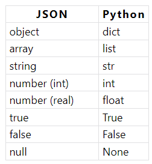

# JSON = Java Script Object Notation = Notation Objet issue de JavaScript
____

### Généralités 

- JSON est un **format léger d'échange de données**. 

- **Facile à lire ou à écrire** pour des humains et aisément **analysable ou générable** par des machines. 

- Basé sur un **sous-ensemble du langage de programmation JavaScript** (JavaScript Programming Language, Standard ECMA-262 3rd Edition - December 1999). 

- JSON est un format texte complètement **indépendant de tout langage**, mais les conventions qu'il utilise seront familières à tout programmeur habitué aux langages descendant du C, comme par exemple : C lui-même, C++, C#, Java, JavaScript, Perl, Python et bien d'autres. 

> Ces propriétés font de JSON un langage d'échange de données idéal.

# 1. Types scalaires
Différents types de variables scalaires : entiers, réels.

## Nombre

    1
    140
    -3
    1.5
    10e10

## Chaînes de caractères 

    "Bonjour les gens"
    "Je veux mettre du \"texte\" entre guillemet"
    "Je saute\nune ligne"

## Booléens

    true
    false

## Null

    null

# 2. Types composés

## Tableaux 

Entre deux **cochets** 

    ["valeur", 3, true]

**Indenter**, pour plus de visibilité 

    [
    "Valeur 1",
    "Valeur 2",
    "Valeur 3"
    ]

Un **tableau**, qui contient un tableau en valeur 

    ["valeur", ["tableau", "imbriqué"]]

## Les objets 

Ls **objets sont un ensemble de paires clé** / valeur qui permet de représenter des concepts complexes. Ces objets sont délimité par des accolades. 

    {
    "firstname": "John",
    "lastname": "Doe",
    "age": 18
    }

Les **valeurs peuvent être de n'importe quel type**, et même être un objet. 

    {
    "firstname": "John",
    "lastname": "Doe",
    "age": 18,
    "job": {
        "name": "Développeur web",
        "startHour": 9,
        "endHour": 19
    }
    }

## Exemple 

    {
        "title": "Tutoriel JSON",
        "content": "...",
        "author": {
            "firstname": "Jonathan",
            "lastname": "Boyer",
            "birthyear": 1987
        },
        "comments": [
            {
                "username": "John Doe",
                "content": "Super tutoriel",
                "replies": []
            }, {
                "username": "Jane Doe",
                "content": "J'ai bien aimé ce tutoriel",
                "replies": [
                    {
                        "username": "John Doe",
                        "content": "...",
                        "replies": []
                    }
                ]
            }
        ]
    }

## Exercice 

.json 

{
    "title": "Tutoriel JSON",
    "content": "..."
    "author": {
        "firestname": "Izabela",
        "Lastname": "Kasiarz",
        "birthyear": 1991
    },
    "comments": []
        { 
            "usernam": "John Doe",
            "content": "Super exercice",
            "replies": []
        }
        {
            "username": "Jane Doe",
            "content": "Essaie encore"
            "replies": {
                "username": "John Doe"
                "content": "Je suis d'accord",
                "replies": []
            }
        }
}

## JSON Schema

JSON Schema est une spécification qui définit une manière de créer un schéma pour annoter et valider un document JSON. Ce schéma est définit à l'aide du format JSON.

    {
    "$id": "https://example.com/address.schema.json",
    "$schema": "https://json-schema.org/draft/2020-12/schema",
    "description": "An address similar to http://microformats.org/wiki/h-card",
    "type": "object",
    "properties": {
        "post-office-box": {
        "type": "string"
        },
        "extended-address": {
        "type": "string"
        },
        "street-address": {
        "type": "string"
        },
        "locality": {
        "type": "string"
        },
        "region": {
        "type": "string"
        },
        "postal-code": {
        "type": "string"
        },
        "country-name": {
        "type": "string"
        }
    },
    "required": [ "locality", "region", "country-name" ],
    "dependentRequired": {
        "post-office-box": [ "street-address" ],
        "extended-address": [ "street-address" ]
    }
    }

## JSONC

JSON with Comments

    // pour écrire un commentaire sur une ligne.
    /* et */ pour délimiter un commentaire multi ligne.

## JSON VIEWER

https://online-json.com/

### SOURCES

https://grafikart.fr/tutoriels/json-77

https://www.json.org/json-en.html

https://rpaframework.org/libraries/json/

