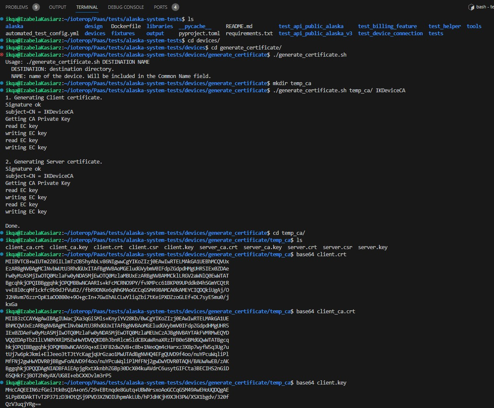

# Launching of IoTerop devices 

Ports Wireshark : 

udp.port == 5683 || udp.port == 5684 || udp.port == 5783 || udp.port == 5784 || tcp.port == 5683 || tcp.port == 5684

# URI
## STAGING
coaps://datagram-ingress.alaska-staging.ioterop.com

ex : 

{ "Server": { "Operation": "Add", "Ssid": 1, "Uri": "coaps://datagram-ingress.alaska-staging.ioterop.com", "Lifetime": 60, "Security":"Psk", "SecureInfo":{"Identity":"IOWAIKA", "Key":"MDEyMzQ1Njc4OQ=="}}}
{ "Fwu": { "Operation": "Add", "PackageName": "package name", "PackageVersion": "1.0" }}
{"Lwm2m": { "Operation": "Start"}}

## DEVENV
coaps://datagram-alaska-ikqa.hypernova.ioterop.com

{ "Server": { "Operation": "Add", "Ssid": 1, "Uri": "coaps://datagram-alaska-staging.hypernova.ioterop.com", "Lifetime": 60, "Security":"Psk", "SecureInfo":{"Identity":"IOWAIKA", "Key":"MDEyMzQ1Njc4OQ=="}}}
{ "Fwu": { "Operation": "Add", "PackageName": "package name", "PackageVersion": "1.0" }}
{"Lwm2m": { "Operation": "Start"}}

## PROD
coaps://datagram-ingress.alaska.ioterop.com

{ "Server": { "Operation": "Add", "Ssid": 1, "Uri": "coaps://datagram-ingress.alaska.ioterop.com", "Lifetime": 60, "Security":"Psk", "SecureInfo":{"Identity":"IOWAIKA", "Key":"MDEyMzQ1Njc4OQ=="}}}
{ "Fwu": { "Operation": "Add", "PackageName": "package name", "PackageVersion": "1.0" }}
{"Lwm2m": { "Operation": "Start"}}

## TCP

## UDP

## NOSEC

### Boostrap NOSEC

{ "BootstrapServer": { "Operation": "Add", "Uri": "coap://datagram-alaska-no-sec-ikqa.hypernova.ioterop.com"}}

### Staging NOSEC

{ "Server": { "Operation": "Add", "Ssid": 1, "Uri": "coap://datagram-no-sec-ingress.alaska-staging.ioterop.com", "Lifetime": 60 }}


### Staging NOSEC

### DevEnv NOSEC

### PROD NOSEC

# 1. Donwload gitlab folder name

git@gitlab.com:IoTerop/PaaS/tests/alaska-system-tests.git
# 2. Payload 
## 3. 


# Commande line 

    # To run the device 

        pythonX.X main.py -s config/start.json -vvv
        pythonX.X main.py -s config/start.json -p  config/temp_settings_2.json -vvv

# Security Credentials
## Transport security 
### PSK
### Certificat

CA_DMS


reg dm certificate - YES

{ "Server": { "Operation": "Add", "Ssid": 1, "Uri": "coaps://datagram-ingress.alaska-staging.ioterop.com", "Lifetime": 60, "Security":"Certificate", "SecureInfo":{"Certificate":"MIIBVTCB+wIUTm2Z0iILlmTzOB5hyAbLv86NIgwwCgYIKoZIzj0EAwIwRTELMAkGA1UEBhMCQVUxEzARBgNVBAgMClNvbWUtU3RhdGUxITAfBgNVBAoMGEludGVybmV0IFdpZGdpdHMgUHR5IEx0ZDAeFw0yMzA5MjIwOTQ0MzlaFw0yNDA5MjEwOTQ0MzlaMBUxEzARBgNVBAMMCklLRGV2aWNlQ0EwWTATBgcqhkjOPQIBBggqhkjOPQMBBwNCAARIs+kFcMCRNO9PY/fvXMPcc61BKP09UPddk04hSGmYCQtRv+E8l0cqMf1ckfc9b9dJfVuB2//fbR9DNXe6qNhGMAoGCCqGSM49BAMCA0kAMEYCIQDQkiUgAj/OJ2HAvm76zzrOpK1aOO080e+9O+gcIn+7GwIhALCLwYliqZbi7tKeiPXDZzoGLEf+DL7syE5mu0/jkxGa", "PrivateKey":"MHcCAQEEIN6zfGeiJtk0sQIA+on5/29+EBtnqde8Gutq+UBWNrsxoAoGCCqGSM49AwEHoUQDQgAESLPpBXDAkTTvT2P371zD3HOtQSj9PVD3XZNOIUhpmAkLUb/hPJdHKjH9XJH3PW/XSX1bgdv/320fQzV3uqjYRg=="}}}

ID : CA
- Common Name : IKDeviceCA
- Certificate : 
```
MIIBVTCB+wIUTm2Z0iILlmTzOB5hyAbLv86NIgwwCgYIKoZIzj0EAwIwRTELMAkGA1UEBhMCQVUxEzARBgNVBAgMClNvbWUtU3RhdGUxITAfBgNVBAoMGEludGVybmV0IFdpZGdpdHMgUHR5IEx0ZDAeFw0yMzA5MjIwOTQ0MzlaFw0yNDA5MjEwOTQ0MzlaMBUxEzARBgNVBAMMCklLRGV2aWNlQ0EwWTATBgcqhkjOPQIBBggqhkjOPQMBBwNCAARIs+kFcMCRNO9PY/fvXMPcc61BKP09UPddk04hSGmYCQtRv+E8l0cqMf1ckfc9b9dJfVuB2//fbR9DNXe6qNhGMAoGCCqGSM49BAMCA0kAMEYCIQDQkiUgAj/OJ2HAvm76zzrOpK1aOO080e+9O+gcIn+7GwIhALCLwYliqZbi7tKeiPXDZzoGLEf+DL7syE5mu0/jkxGa
```
- Certificate authority : 
```
MIIB3zCCAYWgAwIBAgIUWacjXa3qGi5Mls+KnyiYV28Kb/0wCgYIKoZIzj0EAwIwRTELMAkGA1UEBhMCQVUxEzARBgNVBAgMClNvbWUtU3RhdGUxITAfBgNVBAoMGEludGVybmV0IFdpZGdpdHMgUHR5IEx0ZDAeFw0yMzA5MjIwOTQ0MzlaFw0yNDA5MjEwOTQ0MzlaMEUxCzAJBgNVBAYTAkFVMRMwEQYDVQQIDApTb21lLVN0YXRlMSEwHwYDVQQKDBhJbnRlcm5ldCBXaWRnaXRzIFB0eSBMdGQwWTATBgcqhkjOPQIBBggqhkjOPQMBBwNCAAS9q+xEiXF82dw2V8+c8b+1NeoQm4cHarxz3X8p7wyfW5q3Ug7utUj7w6pkJkmi+ElJeeo3tTJtYcKagjqUrGzao1MwUTAdBgNVHQ4EFgQUVD9f4oo/nuYPcuWqliPlMfFNj2gwHwYDVR0jBBgwFoAUVD9f4oo/nuYPcuWqliPlMfFNj2gwDwYDVR0TAQH/BAUwAwEB/zAKBggqhkjOPQQDAgNIADBFAiEApjgRxtXknbhZGBp30DcX04kuAVdrC6usytGIFCta3BECIHS2nGiD6SQHkfzjBOT2h0yAX/UG8I+ebCXXOvlm3rP5
```
- Private key : 
```
MHcCAQEEIN6zfGeiJtk0sQIA+on5/29+EBtnqde8Gutq+UBWNrsxoAoGCCqGSM49AwEHoUQDQgAESLPpBXDAkTTvT2P371zD3HOtQSj9PVD3XZNOIUhpmAkLUb/hPJdHKjH9XJH3PW/XSX1bgdv/320fQzV3uqjYRg==
```


CA_BOOT-EXT-Leshan

MIICKDCCAc+gAwIBAgIURnwIw3M0mK4G0+tMmUj1PhlQkVMwCgYIKoZIzj0EAwIwaTELMAkGA1UEBhMCQVUxEzARBgNVBAgMClNvbWUtU3RhdGUxITAfBgNVBAoMGEludGVybmV0IFdpZGdpdHMgUHR5IEx0ZDEiMCAGA1UEAwwZbGVzaGFuLmVjbGlwc2Vwcm9qZWN0cy5pbzAgFw0yMTA3MDkxNDQ0MTRaGA8yMTIxMDYxNTE0NDQxNFowaTELMAkGA1UEBhMCQVUxEzARBgNVBAgMClNvbWUtU3RhdGUxITAfBgNVBAoMGEludGVybmV0IFdpZGdpdHMgUHR5IEx0ZDEiMCAGA1UEAwwZbGVzaGFuLmVjbGlwc2Vwcm9qZWN0cy5pbzBZMBMGByqGSM49AgEGCCqGSM49AwEHA0IABErD49ZejGF2dVpP8i1xs85aUHJ2PE3XU6nSOtkQ6vZzD1AxBmCiIiGdfsdcgBdVKzGzipIBmn6P2FJf0q5aHtCjUzBRMB0GA1UdDgQWBBTssKYTMXjSRAk/MPTZZal1nxA6fjAfBgNVHSMEGDAWgBTssKYTMXjSRAk/MPTZZal1nxA6fjAPBgNVHRMBAf8EBTADAQH/MAoGCCqGSM49BAMCA0cAMEQCIG7iKVckdsMu9nQQXcvblwOqGXRmO9xxpZiZnGb0oICLAiAWKrzrmac0tYvCDlAfARHDC7mFfKiLbUSIBgroovsH3g==


//

Certificat autho

MIIB3zCCAYWgAwIBAgIUWacjXa3qGi5Mls+KnyiYV28Kb/0wCgYIKoZIzj0EAwIwRTELMAkGA1UEBhMCQVUxEzARBgNVBAgMClNvbWUtU3RhdGUxITAfBgNVBAoMGEludGVybmV0IFdpZGdpdHMgUHR5IEx0ZDAeFw0yMzA5MjIwOTQ0MzlaFw0yNDA5MjEwOTQ0MzlaMEUxCzAJBgNVBAYTAkFVMRMwEQYDVQQIDApTb21lLVN0YXRlMSEwHwYDVQQKDBhJbnRlcm5ldCBXaWRnaXRzIFB0eSBMdGQwWTATBgcqhkjOPQIBBggqhkjOPQMBBwNCAAS9q+xEiXF82dw2V8+c8b+1NeoQm4cHarxz3X8p7wyfW5q3Ug7utUj7w6pkJkmi+ElJeeo3tTJtYcKagjqUrGzao1MwUTAdBgNVHQ4EFgQUVD9f4oo/nuYPcuWqliPlMfFNj2gwHwYDVR0jBBgwFoAUVD9f4oo/nuYPcuWqliPlMfFNj2gwDwYDVR0TAQH/BAUwAwEB/zAKBggqhkjOPQQDAgNIADBFAiEApjgRxtXknbhZGBp30DcX04kuAVdrC6usytGIFCta3BECIHS2nGiD6SQHkfzjBOT2h0yAX/UG8I+ebCXXOvlm3rP5

Certificat

MIIBVTCB+wIUTm2Z0iILlmTzOB5hyAbLv86NIgwwCgYIKoZIzj0EAwIwRTELMAkGA1UEBhMCQVUxEzARBgNVBAgMClNvbWUtU3RhdGUxITAfBgNVBAoMGEludGVybmV0IFdpZGdpdHMgUHR5IEx0ZDAeFw0yMzA5MjIwOTQ0MzlaFw0yNDA5MjEwOTQ0MzlaMBUxEzARBgNVBAMMCklLRGV2aWNlQ0EwWTATBgcqhkjOPQIBBggqhkjOPQMBBwNCAARIs+kFcMCRNO9PY/fvXMPcc61BKP09UPddk04hSGmYCQtRv+E8l0cqMf1ckfc9b9dJfVuB2//fbR9DNXe6qNhGMAoGCCqGSM49BAMCA0kAMEYCIQDQkiUgAj/OJ2HAvm76zzrOpK1aOO080e+9O+gcIn+7GwIhALCLwYliqZbi7tKeiPXDZzoGLEf+DL7syE5mu0/jkxGa

//

Issue propre : 

# Description
# Steps to Reproduce

1. Provision device 
- Device ID : IKDevie_ID
- LwM2M Endpoint Name : IKDevice 
2. with certificate key : 
- ID : CA
- Common Name : IKDeviceCA
- Certificate : 
```
MIIBVTCB+wIUTm2Z0iILlmTzOB5hyAbLv86NIgwwCgYIKoZIzj0EAwIwRTELMAkGA1UEBhMCQVUxEzARBgNVBAgMClNvbWUtU3RhdGUxITAfBgNVBAoMGEludGVybmV0IFdpZGdpdHMgUHR5IEx0ZDAeFw0yMzA5MjIwOTQ0MzlaFw0yNDA5MjEwOTQ0MzlaMBUxEzARBgNVBAMMCklLRGV2aWNlQ0EwWTATBgcqhkjOPQIBBggqhkjOPQMBBwNCAARIs+kFcMCRNO9PY/fvXMPcc61BKP09UPddk04hSGmYCQtRv+E8l0cqMf1ckfc9b9dJfVuB2//fbR9DNXe6qNhGMAoGCCqGSM49BAMCA0kAMEYCIQDQkiUgAj/OJ2HAvm76zzrOpK1aOO080e+9O+gcIn+7GwIhALCLwYliqZbi7tKeiPXDZzoGLEf+DL7syE5mu0/jkxGa
```
- Certificate authority : 
```
MIIB3zCCAYWgAwIBAgIUWacjXa3qGi5Mls+KnyiYV28Kb/0wCgYIKoZIzj0EAwIwRTELMAkGA1UEBhMCQVUxEzARBgNVBAgMClNvbWUtU3RhdGUxITAfBgNVBAoMGEludGVybmV0IFdpZGdpdHMgUHR5IEx0ZDAeFw0yMzA5MjIwOTQ0MzlaFw0yNDA5MjEwOTQ0MzlaMEUxCzAJBgNVBAYTAkFVMRMwEQYDVQQIDApTb21lLVN0YXRlMSEwHwYDVQQKDBhJbnRlcm5ldCBXaWRnaXRzIFB0eSBMdGQwWTATBgcqhkjOPQIBBggqhkjOPQMBBwNCAAS9q+xEiXF82dw2V8+c8b+1NeoQm4cHarxz3X8p7wyfW5q3Ug7utUj7w6pkJkmi+ElJeeo3tTJtYcKagjqUrGzao1MwUTAdBgNVHQ4EFgQUVD9f4oo/nuYPcuWqliPlMfFNj2gwHwYDVR0jBBgwFoAUVD9f4oo/nuYPcuWqliPlMfFNj2gwDwYDVR0TAQH/BAUwAwEB/zAKBggqhkjOPQQDAgNIADBFAiEApjgRxtXknbhZGBp30DcX04kuAVdrC6usytGIFCta3BECIHS2nGiD6SQHkfzjBOT2h0yAX/UG8I+ebCXXOvlm3rP5
```
- Private key : 
```
MHcCAQEEIN6zfGeiJtk0sQIA+on5/29+EBtnqde8Gutq+UBWNrsxoAoGCCqGSM49AwEHoUQDQgAE
SLPpBXDAkTTvT2P371zD3HOtQSj9PVD3XZNOIUhpmAkLUb/hPJdHKjH9XJH3PW/XSX1bgdv/320f
QzV3uqjYRg==
```
2. Connect the device 
Device start.json : 
```
{ "Server": { "Operation": "Add", "Ssid": 1, "Uri": "coaps://datagram-ingress.alaska-staging.ioterop.com", "Lifetime": 60, "Security":"Certificate", "SecureInfo":{"Certificate":"MIIBVTCB+wIUTm2Z0iILlmTzOB5hyAbLv86NIgwwCgYIKoZIzj0EAwIwRTELMAkGA1UEBhMCQVUxEzARBgNVBAgMClNvbWUtU3RhdGUxITAfBgNVBAoMGEludGVybmV0IFdpZGdpdHMgUHR5IEx0ZDAeFw0yMzA5MjIwOTQ0MzlaFw0yNDA5MjEwOTQ0MzlaMBUxEzARBgNVBAMMCklLRGV2aWNlQ0EwWTATBgcqhkjOPQIBBggqhkjOPQMBBwNCAARIs+kFcMCRNO9PY/fvXMPcc61BKP09UPddk04hSGmYCQtRv+E8l0cqMf1ckfc9b9dJfVuB2//fbR9DNXe6qNhGMAoGCCqGSM49BAMCA0kAMEYCIQDQkiUgAj/OJ2HAvm76zzrOpK1aOO080e+9O+gcIn+7GwIhALCLwYliqZbi7tKeiPXDZzoGLEf+DL7syE5mu0/jkxGa", "PrivateKey":"MHcCAQEEIN6zfGeiJtk0sQIA+on5/29+EBtnqde8Gutq+UBWNrsxoAoGCCqGSM49AwEHoUQDQgAESLPpBXDAkTTvT2P371zD3HOtQSj9PVD3XZNOIUhpmAkLUb/hPJdHKjH9XJH3PW/XSX1bgdv/320fQzV3uqjYRg=="}}}
{ "TestHelper": { "Operation": "Enable"}}
{ "TestHelper": { "Operation": "Add", "Instance": 0}}
{ "TestHelper": { "Operation": "Add", "Instance": 1}}
{ "Fwu": { "Operation": "Add", "PackageName": "package name", "PackageVersion": "1.0" }}
{"Lwm2m": { "Operation": "Start"}}
```



## Expected Result

See the possibility to make a key rotation. 


## Application security 
## Oscor 

{ "BootstrapServer": { "Operation": "Add", "Uri": "coaps://datagram-ingress.alaska.ioterop.com", "Security":"Psk", "SecureInfo":{"Identity":"YjZvYm8=", "Key":"MWl3OGM="}, "Oscore":true, "OscoreInfo":{"SenderId":"OTk5b28=", "RecipientId":"ZjE4", "MasterSecret": "QUJDREVG"}}}

# UDP / TCP
# Bootstrap

Ex : 
{ "BootstrapServer": { "Operation": "Add", "Uri": "coaps://datagram-alaska-ikqa.hypernova.ioterop.com", "Security":"Psk", "SecureInfo":{"Identity":"YjZvYm8=", "Key":"MWl3OGM="}, "Oscore":true, "OscoreInfo":{"SenderId":"OTk5b28=", "RecipientId":"ZjE4", "MasterSecret": "QUJDREVG"}}}
// { "Fwu": { "Operation": "Add", "PackageName": "package name", "PackageVersion": "1.0" }}
{"Lwm2m": { "Operation": "Start"}}

# External Bootstrap

coapsleshan.eclipseprojects.io5684

{ "Server": { "Operation": "Add", "Ssid": 1, "Uri": "coaps://leshan.eclipseprojects.io:5684", "Lifetime": 60, "Security":"Psk", "SecureInfo":{"Identity":"mVSwwOYY", "Key":"1uoPsysU"}}}
{ "Ipso": { "Operation": "Add","Type":3303,"Value":1.0,"Unit":"C","AppType":"Temperature","RangeMin":10,"RangeMax":20}}
{ "Fwu": { "Operation": "Add", "PackageName": "package name", "PackageVersion": "1.0" }}
{ "Lwm2m": { "Operation": "Start"}}


# NOTE A TRIER
Tutoriel mise en place de plusieur devices à lancer lors de test

1. Ouvrir un iowatestclient sur vscode

2. Dans config, laisser en standard settings.json et stat.json

3. Dans config, créer temp_settings_2.json (et ou temp_start.json) et les modifier selon les besoins du test

4. Dans .gitignore, ajouter **temp_** pour éviter l'enregistrement des fichiers inutiles au bien commun

5. Modifier temp_settings_2.json (et ou temp_start.json) selon les besoins du test

6. Provisionner les devices relatifs aux éventuels plusieurs temp_settings_2.json créés

7. Lancer sur vscode, dans des terminaux linux séparés, dans le même dossier racine (ex : iowatestclient) :

(help : python3.10 main.py -h)

Client 1 : $ python3.10 main.py -s config/start.json -vvv

Client TRUE2 : $ python3.10 main.py -s config/start.json config/temp_settings_2.json -vvv

Client 2 : $ python3.10 main.py -vvv -p config/temp_settings_2.json (redemande pourquoi p car selon besoins)
++++ lancer les lignes de commandes contenues dans start.json (necessaire pour lancer le server, et start le server)

Client 3 : $ python3.9 main.py -vvv -p config/temp_settings_3.json
++++ lancer les lignes de commandes contenues dans start.json (necessaire pour lancer le server, et start le server)

Plutôt utiliser python3.10 : 
Client 1 : $ python3.10 main.py -vvv
Client 2 : $ python3.10 main.py -vvv -p config/temp_settings_2.json (redemande pourquoi p car selon besoins)
python3.10 main.py -s config/start.json -vvv -p config/temp_settings_2.json

Client 3 : $ python3.10 main.py -vvv -p config/temp_settings_3.json

## Tuto Moïse

1) Dans ton Linux cree toi un dossier (mkdir) ou deplace toi dans un dossier vide (cd) ou tu pourra cloner le projet
2) clone le projet IowaTestClient en local sur ton ordinateur
   lien du depot, copie-colle dans ton navigateur : https://gitlab.com/IoTerop/IOWA/TestApps/iowatestclient/-/tree/main/
3) Soit tu suis les sous étapes de cette partie soit tu lis le fichier README du projet IowaTestClient que tu auras cloné, les étapes qui vont suivre sont les meme que dans le README :
   a) clone le projet 
      command : git clone --recurse-submodules git@gitlab.com:IoTerop/IOWA/TestApps/iowatestclient.git
   b) une fois le projet cloné, deplace toi à l'interieur du dossier cloné :
      command : cd nom_du_projet
   c) install des biblio neccesaires :
      command : python3 -m pip install -r requirements.txt
   d) build l'application IowaTestClient
      command :
        - mkdir build
        - cd build
        - cmake ..
        - make
5) reviens à la racine du projet et ouvre ton projet sur VSCODE
   command : code .
4) Configure la securité pour ton client IowaTestClient pour qu'il puisse se connecter à Alaska, il ya plusieurs securité mais on va utiliser le PSK Securité
   - ouvre le fichier "start.json" qui se trouve dans le dossier "config"
   - remplace ce qui suit dans le fichier :

   { "Server": { "Operation": "Add", "Ssid": 1, "Uri": "coaps://datagram-ingress.alaska-staging.ioterop.com", "Lifetime": 60, "Security":"Psk", "SecureInfo":{"Identity":"IOWAIKA", "Key":"MDEyMzQ1Njc4OQ=="}}}
   { "TestHelper": { "Operation": "Enable"}}
   { "TestHelper": { "Operation": "Add", "Instance": 0}}
   { "TestHelper": { "Operation": "Add", "Instance": 1}}
   { "TestHelper": { "Operation": "Add", "Instance": 2}}
   {"Lwm2m": { "Operation": "Start"}}
6) Au niveau du server Alaska "alaska-staging.ioterop.com" provisionne ton client avec les informations que tu as rentré dans le fichier start.jsonls
  - Device Name : IKDevice
  - Security Pre-Shared key
    - Identity : IOWAIKA
    - Secret : MDEyMzQ1Njc4OQ==
7) revient dans ton terminal, deplace toi à la racine du projet IowaTestClient et lance l'application IowaTestClient
   command : python3.10 main.py -l build/libclient.so -s config/start.json -p config/settings.json -vv = Alias pclient (verbos 3 niveaux) - python3 main.py -vv
python3.10 main.py -s config/start.json -vvv
8) Ton client devrait être connecté à Alaska
