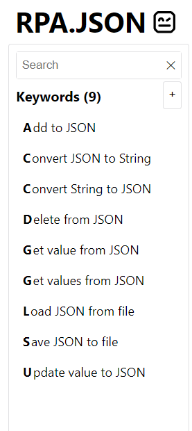

# JSON - Manipulate JSON objects

JSON is a library for manipulating JSON files and strings.

# JSONPath

# The Keywords about JSON

## Add to JSON

**Add items into a JSON serializable object and return the result.**

If the target is a list, the values are appended to the end. If the target is a dict, the keys are either added or updated.

        *** Task ***
        Change the name value for all people
            &{before}=    Convert string to JSON   {"People": [{"Name": "Mark"}, {"Name": "Jane"}]}
            &{person}=    Create dictionary      Name=John
            &{after}=     Add to JSON    ${before}   $.People    ${person}

## Convert JSON to String

Robot Framework Example:

        *** Task ***
        Convert to string
            ${obj}=    Create dictionary    Key=Value
            ${json}=   Convert JSON to string    ${obj}
            Should be equal    ${json}     {"Key": "Value"}

## Convert String to JSON

Robot Framework Example:

        *** Task ***
        Convert to json
            ${json}=    Set variable    {"Key": "Value"}
            &{obj}=     Convert string to JSON    ${json}
            Should be equal    ${obj.Key}    Value

## Delete from JSON

Example:

        *** Task ***
        Delete all people
            &{before}=    Convert string to JSON   {"People": [{"Name": "Mark"}, {"Name": "Jane"}]}
            &{after}=     Delete from JSON    ${before}   $.People[*]

## Get value from JSON

Extended Robot Framework Example:

        *** Settings ***
        Library         RPA.JSON
        Suite Setup     Ingest JSON

        *** Variables ***
        ${JSON_STRING}      {
        ...                   "clients": [
        ...                     {
        ...                       "name": "Johnny Example",
        ...                       "email": "john@example.com",
        ...                       "orders": [
        ...                         {"address": "Streetroad 123", "state": "TX", "price": 103.20, "id":"guid-001"},
        ...                         {"address": "Streetroad 123", "state": "TX", "price": 98.99, "id":"guid-002"}
        ...                       ]
        ...                     },
        ...                     {
        ...                       "name": "Jane Example",
        ...                       "email": "jane@example.com",
        ...                       "orders": [
        ...                         {"address": "Waypath 321", "state": "WA", "price": 22.00, "id":"guid-003"},
        ...                         {"address": "Streetroad 123", "state": "TX", "price": 2330.01, "id":"guid-004"},
        ...                         {"address": "Waypath 321", "state": "WA", "price": 152.12, "id":"guid-005"}
        ...                       ]
        ...                     }
        ...                   ]
        ...                 }
        ${ID}               guid-003

        *** Tasks ***
        Get email for specific order id
            ${email}=    Get value from json    ${JSON_DOC}    $.clients[?(@..id=="${ID}")].email
            Log    \nOUTPUT IS\n ${email}    console=${True}
            Should be equal as strings    ${email}    jane@example.com

        *** Keywords ***
        Ingest JSON
            ${doc}=    Convert string to json    ${JSON_STRING}
            Set suite variable    ${JSON_DOC}    ${doc}

## Get values from JSON

Short Robot Framework Example:

        *** Task ***
        Get all the names for all people
            &{people}=    Convert string to JSON   {"People": [{"Name": "Mark"}, {"Name": "Jane"}]}
            @{names}=     Get values from JSON     ${people}   $.People[*].Name

## Load JSON from file

Example:

        *** Task ***
        Load json
            &{auth}=    Load JSON from file    auth.json
            Log   Current auth token: ${auth.token}

## Save JSON to file

Robot Framework Example:

        *** Tasks ***
        Save dictionary to file
            ${john}=    Create dictionary    name=John    mail=john@example.com
            Save JSON to file    ${john}    john.json

        Save string to file
            ${mark}=    Set variable    {"name": "Mark", "mail": "mark@example.com"}
            Save JSON to file    ${mark}    mark.json

## Update valu to JSON

Short Robot Framework Example:

        *** Tasks ***
        Change the name key for all people
            &{before}=    Convert string to JSON   {"People": [{"Name": "Mark"}, {"Name": "Jane"}]}
            &{after}=     Update value to JSON     ${before}   $.People[*].Name    JohnMalkovich

# Sources 
 
https://rpaframework.org/libdoc/RPA_JSON.html

TODO: Créer des listes 
https://robotframework.org/robotframework/latest/libraries/Collections.html