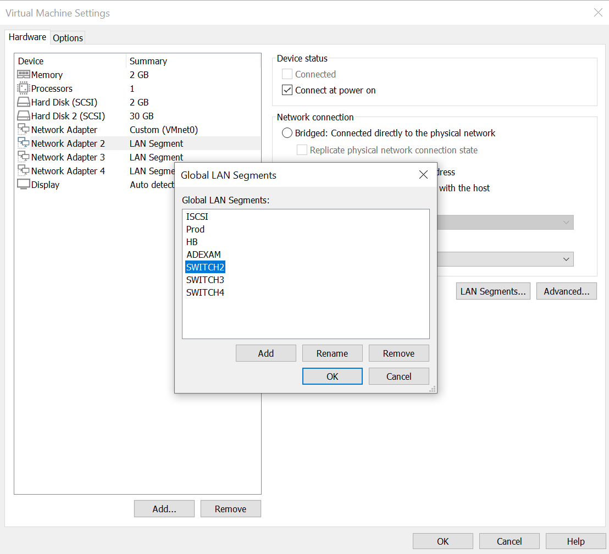

# DAT : Dossier d'Architecture Technique
## LAB du 06 11 2023
### Intégrer et gérer les différents environnements de travail

Schema du projet final : 

# Créer les VM suivantes :

- PC client sous Windows10

        ram : 4go
        stockage : 60go
        Login : client-Win10
        mdp : root
        LANIP : 10.100.0.1/16

- Ubuntu Server - Server web

        ram : 4go
        stockage: 20go
        Login : serverwebUbu / toor
        mdp : root
        DMZIP : 10.250.0.2/24

        nano /etc/netplan/00-installer-config.yaml

        sudo netplan apply

        ip a

- Windows server - DHCP / DNS / AD

        ram : 2go
        stockage : 60go
        Login : WinServ-DHCPDNSAD
        mdp : root
        LANIP : 10.200.0.0/24

### setup

1. Configurer la carte réseau 1 en mode pont identifié (sur wifi)

2. Configurer les cartes réseaux 2,3,4 en LAN Segment, créer 3 vSwitch (LAN segment)

3. Reset de la licence:

        execute factoryreset

4. Configurer la VM avec les données suivantes : 

        Login: qd,in (admin)
        Password: aucun de base [Entrée]
        New Password: toor
        Repeat Password: toor

5. S'accorder les accès administration via SSH

        config system interface
            edit port1
            set allowaccess https http ssh
            end

6. Récupérer l'adresse IP sur le port1

        get system interface physical

7. Se connecter via le portail web 

____
8. Fortigate : 

        1. Adapter les configurations à vos segments réseaux

- plan d'adressage interfaces LAN01, LAN02, DMZ :
  - Interface LAN01 : 10.100.0.0/16
    - IP : 10.100.0.1/255.255.0.0
    - Gw : 10.100.0.254/16
    - Pool dhcp : 10.100.0.2-10.100.255.254/16
  - Interface LAN02 : 10.200.0.0/24
    - IP : 10.200.0.1/255.255.255.0
    - Gw : 10.200.0.254/16
    - Pool dhcp : 10.200.0.2-10.200.0.254/24
  - Interface DMZ : 10.250.0.1/24
  - Fortigate Rxip : 10.0.0.0
    - Ip hôte Fortigate : 10.0.0.70/24

- 2. Configuration de la route par défaut vers internet

  - Route par defaut : 0.0.0.0

  3. Configuration des règles de Firewall de sortie vers Internet

= Autoriser HTTP et HTTPS et le trafic DNS à sortir sur internet

- Lan01_DNS_to_Internet

- Lan02_DNS_to_Internet

- DMZ_DNS_to_Internet

4. Contrôler depuis une VM dans un des LAN

Backup en local

## Etape 1 - Policy rules inter-lan / inter-vlan

## Configuration DHCP
Info de base  :
- Windows server - DHCP / DNS / AD

        ram : 2go
        stockage : 60go
        Login : WinServ-DHCPDNSAD
        mdp : root
        LANIP : 10.200.0.0/24

- Créer une étendue 

## Configuration DNS
- Nom de la zone : dns_lab

