# Installation Debian et Clonezilla

# Introduction 

2 versions : 
- Clonezilla live (runs from a live CD) : pas de multicasting
- Clonezilla SE (Server Edition): pour le multicastig 

## Préparation du système source : debian 12 
### Installation des prérequis nécessaires sur le système source

Les outils : 

        sudo apt-get update

Installer le serveur SSH :

        sudo apt-get install openssh-server

* Créer un utilisateur et lui donner les droits SUDOERS

        nano /etc/sudoers

Résultats : 

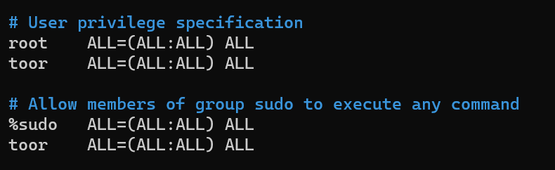

* Créer un group ssh_group et y ajouter l'utilisateur admin

        addgroup ssh_group
        usermod -a -G ssh_group toor

* Ajouter le group ssh_group dans le fichier config ssh

        nano /etc/ssh/sshd_config
        systemctl restart ssh

Résultat : 

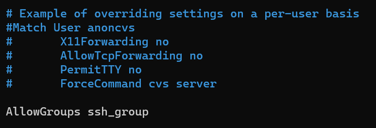

* Se connecter en SSH

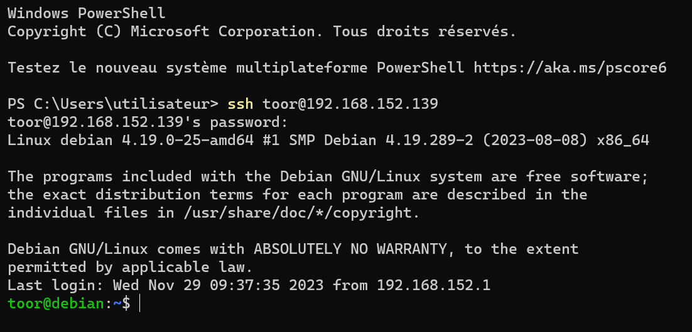

* Paramétrer le réseau :
 * Nat pour avoir internet au paramétrage 

        nano /etc/network/interfaces

                    # The loopback network interface
                    auto lo
                    iface lo inet loopback

                    # The primary network interface
                    allow-hotplug ens33
                    auto ens33
                    iface ens33 inet dhcp

                    # The secondary network interface
                    allow-hotplug ens34
                    iface ens34 inet static
                            address 172.19.0.1
                            netmask 255.255.255.0
                            network 172.19.0.0
        
        systemctl restart networking
        ip a

 Résultat : 

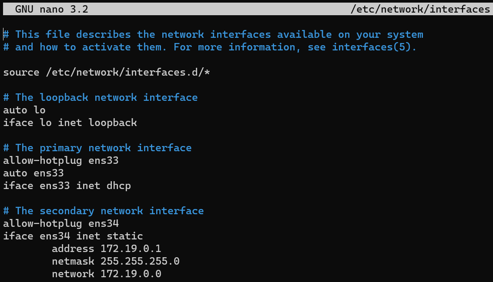

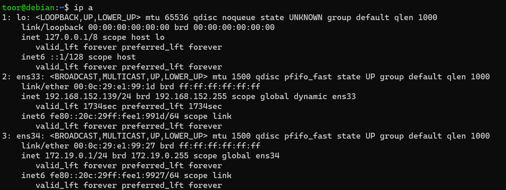

* Installer le DHCP

        apt-get install isc-dhcp-server
        nano /etc/dhcp/dhcpd.conf
        nano /etc/default/isc-dhcp-server
        systemctl restart isc-dhcp-server
        systemctl enable isc-dhcp-server
        systemctl status isc-dhcp-server
        journalctl -u isc-dhcp-server.service

Résultats : 

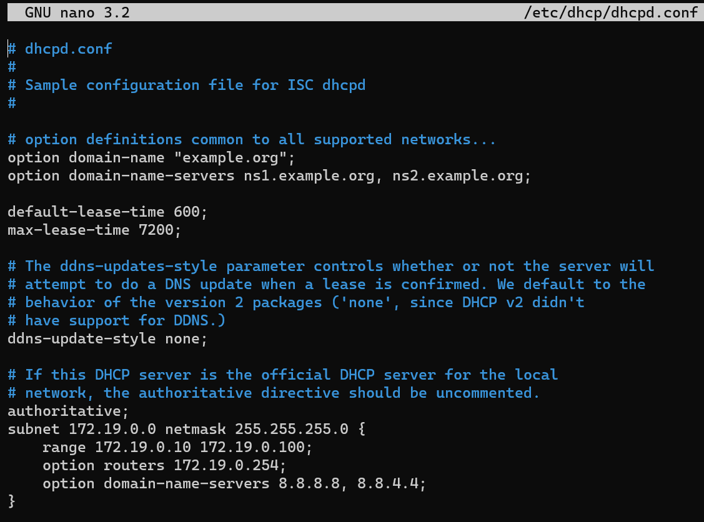

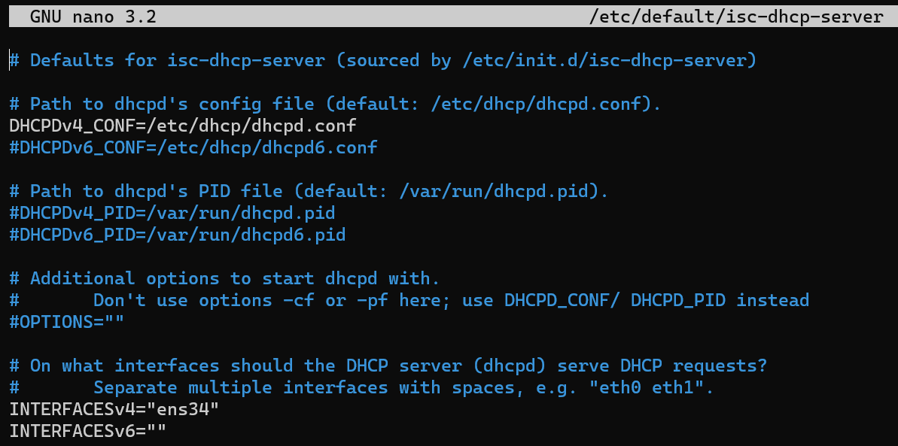

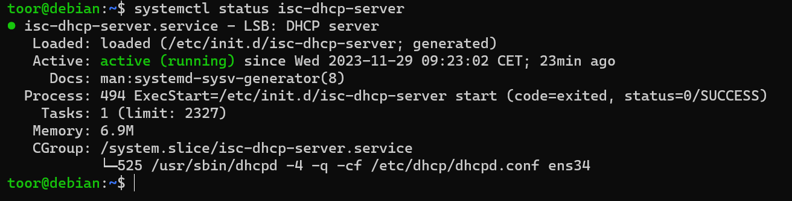

**ATTENTION : ISC DHCP SERVER va disparaitre, probablement au profit de KEA DHCP4 : https://packages.debian.org/fr/sid/kea-dhcp4-server. **

 * Lan segment pour créer le réseau de déploiement

 Résultat : 

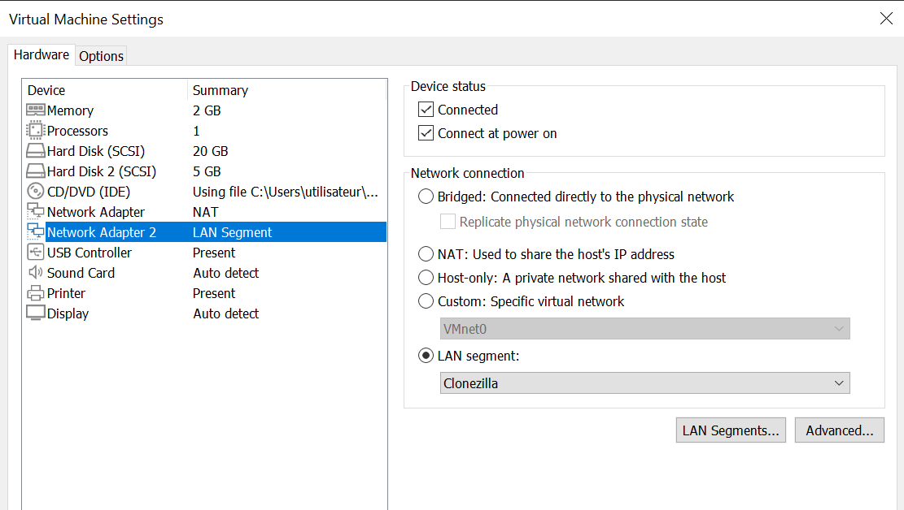

* Installer Clonezilla

        sudo apt-get install clonezilla

* Installer DRBL

        apt-get install drbl

A vérifier : 

            nano /etc/apt/sources.list (??)
            sudo apt-get update

https://drbl.sourceforge.net/installation/02-install-required-packages.php#Linux_install

Résultat : 

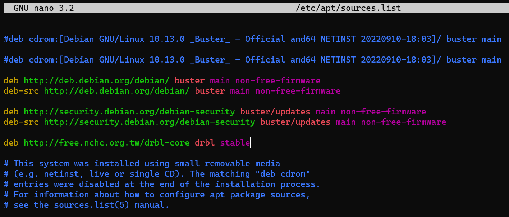

* Configurer Clonezilla 

        /usr/sbin/drblpush -i
        nano /etc/drbl/drbl-ocs.conf

        /usr/sbin/dcs

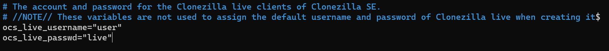

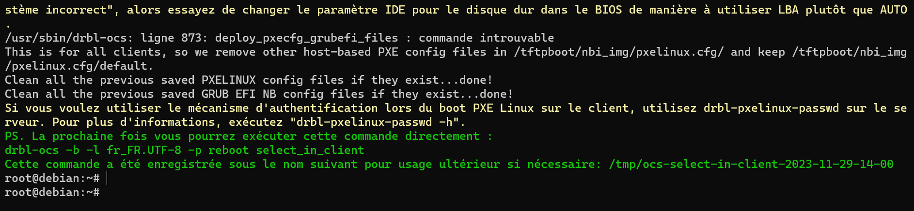

drbl-ocs -b -l fr_FR.UTF-8 -p reboot select_in_client

https://dwaves.de/wp-content/uploads/2014/10/Setup-a-Clonezilla-Server-on-Debian-Ubuntu.pdf