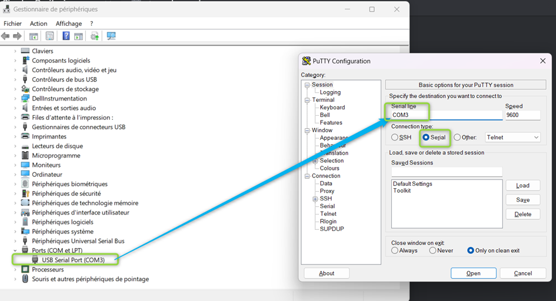

SIMPLON R&S
10.09.2023

Exemple config Switch L3

en
conf t

ip routing

vlan 10
name data_client

vlan 20
name server

vlan 99
name Management

vlan 200
name interco

int vlan 10
ip address 10.10.10.254 255.255.255.0

int vlan 20
ip address 10.10.20.254 255.255.255.0

int vlan 99
ip address 10.10.99.254 255.255.255.0

int vlan 200
ip address 10.10.200.254 255.255.255.0

ip route 0.0.0.0 0.0.0.0 10.10.200.1

int range G1/0/1-10
description laptop
switchport mode access
switchport access vlan 10

int G1/0/20
description vers_esxi
switchport mode trunk
switchport trunk allowed vlan all

int G1/0/24
description interco_firewall
switchport mode access
switchport access vlan 200

do wr mem

Administration Switch or Router witch Console Cable RS232
